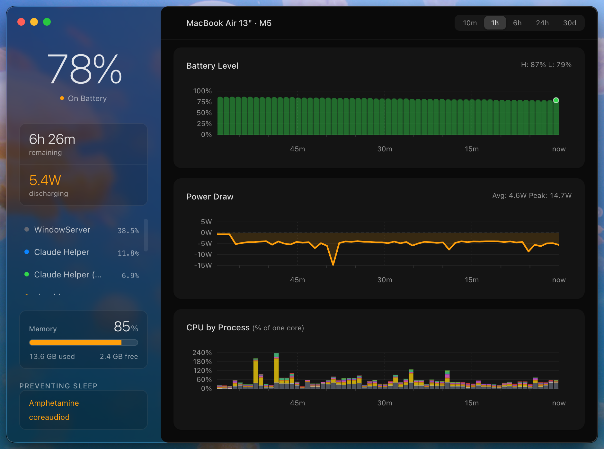

# PowerMonitor

A retrospective system monitor for Apple Silicon Macs. Most tools show you
power and CPU usage *right now* — PowerMonitor keeps a history, so you can
go back and see what your battery, power draw, and top processes were doing
10 minutes or 30 days ago.



> **Alpha software.** Expect rough edges. Feedback welcome.

---

## Features

- **Battery history** — charge/discharge level over time, with charging state and estimated time remaining
- **Power draw** — real-time wattage (positive while charging, negative while discharging)
- **CPU by process** — per-core usage breakdown for your top processes over the selected window, switchable between stacked-blocks and smooth views
- **System info** — chip, cores, GPU cores, RAM, battery health and cycle count
- **Memory pressure** — usage colored by actual `kern.memorystatus_vm_pressure_level`, not just percentage full
- **Sleep assertions** — see what's keeping your Mac awake, with system noise filtered out
- **Time ranges** — 10 minutes, 1 hour, 6 hours, 24 hours, or 30 days, each with axis labels suited to the range
- **Hover for detail** — every chart shows exact values and timestamps for the sample under your cursor
- **Liquid Glass sidebar** — real `NSGlassEffectView` material on macOS 26 (Tahoe) and later, with several switchable presets under View ▸ Glass Style; falls back to standard vibrancy on earlier macOS versions
- **Light/dark/system theme**, native to macOS
- **Runs in the background** — a LaunchAgent logs every 60 seconds even while the app itself is closed
- **Local only** — everything lives in a SQLite database on your machine; nothing is sent anywhere

---

## Requirements

- macOS 13 (Ventura) or later
- Apple Silicon (M1 or newer)
- macOS 26 (Tahoe) or later for the real Liquid Glass sidebar material — earlier versions fall back to vibrancy automatically, no separate build needed

---

## Install

1. Download the latest `PowerMonitor-*.dmg` from [Releases](../../releases/latest)
2. Open the DMG and drag **PowerMonitor.app** into your Applications folder
3. Launch it — on first run, PowerMonitor installs its background logger automatically

> **Gatekeeper note:** the app isn't notarized yet, so right-click → Open on first launch if macOS blocks it.

---

## How it works

```
LaunchAgent logger  →  ~/.local/powermon.db (SQLite)  →  PowerMonitor.app
   samples every 60s         local, never synced           reads + renders
```

PowerMonitor installs a macOS LaunchAgent that samples your system every 60
seconds using the bundled Electron binary — no separate runtime required.
Each sample is written to a local SQLite database. The app itself only
reads from that database and draws charts over whichever time window
you've selected; it never writes to the log on its own.

Each sample records:
- Battery percentage, charging state, amperage, voltage, estimated time remaining
- Top CPU- and memory-consuming processes
- Sleep assertions — anything currently preventing the Mac from sleeping

---

## Build from source

```bash
# Prerequisites: Node.js, npm, Homebrew
brew install create-dmg

git clone https://github.com/kanin-design/PowerMonitor.git
cd PowerMonitor
npm install
npm run build
```

This packages the app and produces a DMG in the project root.

---

## Your data

Everything lives locally at `~/.local/powermon.db` (SQLite) — nothing leaves your machine.

Inspect it directly:

```bash
sqlite3 ~/.local/powermon.db "SELECT ts, battery FROM power_log ORDER BY ts_unix DESC LIMIT 10"
```

Remove the background logger entirely:

```bash
launchctl unload ~/Library/LaunchAgents/com.delfinsoft.powermonitor.plist
rm ~/Library/LaunchAgents/com.delfinsoft.powermonitor.plist
```

---

## License

MIT © 2026 Delfinsoft
